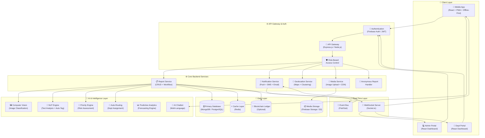
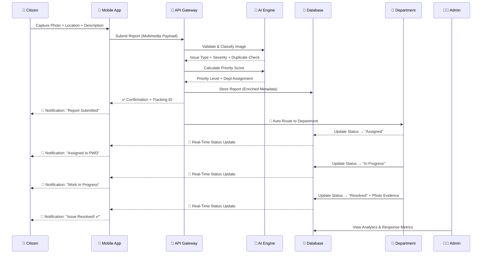

<p align="center">
  
</p>

<h1 align="center">🏙️ CivicFix — Crowdsourced Civic Issue Reporting & Resolution System</h1>

<p align="center">
  <em>Empowering citizens. Enabling governance. Engineering accountability.</em>
</p>

<p align="center">
  
  
  
  
  
  
</p>

---

## 📑 Table of Contents

- [Background & Motivation](#-background--motivation)
- [Problem Statement](#-problem-statement)
- [Expected Solution](#-expected-solution)
- [System Architecture](#-system-architecture)
- [Features](#-features)
- [Implementation Phases](#-implementation-phases)
- [Tech Stack](#-tech-stack)
- [Project Structure](#-project-structure)
- [Getting Started](#-getting-started)
- [Development Progress](#-development-progress)
- [Contributing](#-contributing)
- [License](#-license)

---

## 🌍 Background & Motivation

Local governments often face challenges in promptly identifying, prioritizing, and resolving everyday civic issues like **potholes**, **malfunctioning streetlights**, or **overflowing trash bins**. While citizens encounter these issues daily, a lack of effective reporting and tracking mechanisms limits municipal responsiveness.

A streamlined, **mobile-first solution** can bridge this gap by empowering community members to submit real-world reports that municipalities can systematically address.

> **CivicFix** transforms passive complaint systems into an active, AI-powered, citizen-centric platform — driving transparency, accountability, and faster resolution of civic issues.

---

## 🔴 Problem Statement

### The Challenge (La Trobe–Style)

Urban communities face persistent challenges in reporting and resolving civic issues such as **sanitation problems**, **damaged infrastructure**, and **public safety concerns**. Existing reporting mechanisms are often:

| Problem Area | Impact |
|:---|:---|
| **Fragmented channels** | Citizens don't know where or how to report |
| **Slow response** | Issues escalate before being acknowledged |
| **No real-time tracking** | Zero visibility for citizens after submission |
| **Poor prioritization** | All reports treated equally despite varying severity |
| **No data-driven insights** | Authorities cannot predict or prevent recurring issues |
| **Scalability failures** | Systems crash during peak reporting periods |

### Core Pain Points

**For Citizens:**
- No simple, real-time method to report issues with sufficient context (location + visual evidence)
- No feedback loop once a report is submitted
- Privacy concerns deter participation

**For Administrative Bodies:**
- Managing large volumes of unstructured complaints
- Prioritizing urgent cases among hundreds of submissions
- Routing reports efficiently to the appropriate departments
- Scaling during peak periods (monsoons, festivals, elections)

### The Gap

The absence of a **centralized, real-time overview** of reported issues limits data-driven decision-making, making it difficult for authorities to:
- Identify high-priority areas
- Allocate resources effectively
- Provide timely updates to citizens

> This gap highlights the need for a **scalable, user-friendly, and responsive civic issue reporting framework** that improves communication, accountability, and resolution efficiency within urban governance.

---

## ✅ Expected Solution

The final deliverable includes:

1. **Mobile-First Platform** — Cross-device citizen interface for effortless issue capture, tracking, and notifications at every stage (Confirmation → Acknowledgment → Resolution)

2. **Administrative Web Portal** — Municipal staff can filter issues by category/location/priority, assign tasks, update statuses, and communicate progress

3. **Automated Routing Engine** — Leverages report metadata (image + location + text) to correctly allocate tasks to the right departments

4. **Scalable Backend** — Manages high volumes of multimedia content, supports concurrent users, and provides APIs for future integrations

5. **Analytics & Reporting** — Insights into reporting trends, departmental response times, and overall system effectiveness

---

## 🏗️ System Architecture

### High-Level Architecture Diagram



### Data Flow — Report Lifecycle



---

## 🚀 Features

### 1. 🎛️ Multi-Role Dashboard System
| Role | Capabilities |
|:---|:---|
| **Citizens (Users)** | Submit complaints, track status, receive updates, view community feed |
| **Departments** | View assigned tasks, update progress, manage workloads, report resolution |
| **Admins** | Monitor overall system, analytics, inter-department coordination, user management |

Role-based access ensures better management and streamlined operations.

---

### 2. 📰 Centralized Problem Feed (Homepage Insights)
- **Most reported issues** (e.g., potholes, garbage hotspots)
- **Nearby active complaints** based on user location
- **Trending civic problems** in the locality
- Increases awareness, transparency, and community engagement

---

### 3. 🔄 Real-Time Tracking & Status Updates
- **Live status pipeline:** `Reported → Assigned → In Progress → Resolved`
- Push notifications at each stage of resolution
- Estimated resolution time tracking
- Builds trust and keeps users informed

---

### 4. 🤖 AI-Powered Chatbot Assistant
- Guide users in filing complaints step-by-step
- Answer queries about complaint status and procedures
- Provide suggestions and FAQs in **multiple languages**
- Improves accessibility and reduces manual support dependency

---

### 5. 👻 Anonymous Reporting System
- Submit complaints **anonymously** while retaining issue tracking
- Secure and confidential data handling
- Encourages more participation and honest reporting without fear

---

### 6. 🧠 AI-Powered Smart Validation of Reports
Using **Computer Vision + NLP** to:
- Detect if an issue is **already reported nearby** (duplicate detection)
- Flag **spam/irrelevant photos** (selfies, memes, etc.)
- **Auto-tag issue type** (pothole, garbage, traffic light) from image + text
- Reduces junk data and workload for municipal staff

---

### 7. 🎯 Priority & Risk Assessment Engine
Not all issues are equal — *a pothole near a hospital ≠ pothole in an empty field*.
- **Location sensitivity** scoring (schools, hospitals, highways)
- **Report frequency** (more complaints = higher priority)
- **Severity estimation** (AI-powered from image analysis)
- Ensures smarter resource allocation beyond "first come first serve"

---

### 8. 📴 Offline-First Mobile App
- Capture **photo + location offline** in rural/low-connectivity areas
- Data **auto-syncs** when network comes back
- Progressive Web App (PWA) capabilities

---

### 9. 📈 Predictive Analytics for Governance
AI-powered forecasting:
- Which areas are most likely to face **garbage overflow next week**?
- Which ward has the **slowest response time** historically?
- **Seasonal issue prediction** (e.g., monsoon potholes)
- Helps government move from **reactive → proactive** governance

---

### 10. ♿ Accessibility & Inclusivity Features
- **Voice-based reporting** (Hindi + regional languages)
- Support for **visually impaired** (voice prompts, speech-to-text)
- **Senior-citizen-friendly** interface (big buttons, simple flow)
- Not just techy — but truly **citizen-centric**

---

### 11. 🔀 AI-Based Automatic Department Routing
Using **Computer Vision + rule-based mapping** to:
- Identify issue type from uploaded images
- Automatically **map to correct department** (PWD, Sanitation, Electricity Board)
- Route complaints **without user intervention**
- Use location data to assign to the **nearest responsible office**
- Eliminates user confusion, reduces misreported complaints

---

### 12. 🗺️ AR / Map-Based Issue Visualization
- Interactive **map with real-time clustering** instead of boring lists
- **AR mode** (camera + GPS) → see nearby unresolved issues projected on screen
- Spatial clarity for municipalities and engaging UX for citizens

---

### 13. 🔗 Blockchain-Based Transparency Layer *(Optional)*
- Store timestamps of `Report → Acknowledgment → Resolution` on a lightweight blockchain ledger
- Citizens can **verify** that their report wasn't deleted or manipulated
- Builds immutable **trust + accountability**

---

## 📅 Implementation Phases

> Phases are ordered by **priority** — foundational features first, advanced intelligence later.

### Phase 1 — Foundation & Core Infrastructure *(Current)*
> *"Build the skeleton — auth, database, project structure."*

| Item | Description | Status |
|:---|:---|:---:|
| Project scaffolding | React + Vite + TailwindCSS setup | ✅ Done |
| Folder & file structure | Components, pages, services, utils | ✅ Done |
| Authentication system | JWT Auth (Email/Password + Protected Routes) | ✅ Done |
| Database schema design | MongoDB Atlas — User & Report models | ✅ Done |
| Role-based access control | Citizen / Department / Admin roles + middleware | ✅ Done |
| Basic API endpoints | Auth, Users, Reports — full CRUD | ✅ Done |
| Backend migration | Separated to `Latrobe-Backend/` (clean architecture) | ✅ Done |
| Frontend-backend integration | API service layer + AuthContext | ✅ Done |

---

### Phase 2 — Citizen Report Submission & Tracking
> *"The core user journey — report an issue & track it."*

| Item | Description | Status |
|:---|:---|:---:|
| Report submission form | Photo upload, category, location, description | 🔄 Partial |
| Auto location tagging | GPS-based auto-fill via Geolocation API | ⬜ Pending |
| Image upload pipeline | Firebase Storage / Cloudinary integration | ⬜ Pending |
| Report tracking dashboard | Status timeline (Reported → Resolved) | ⬜ Pending |
| Unique tracking IDs | Auto-generated per report | ⬜ Pending |
| Anonymous reporting mode | Toggle anonymous submission | ⬜ Pending |

---

### Phase 3 — Multi-Role Dashboards & Admin Portal
> *"Separate views for Citizens, Departments, and Admins."*

| Item | Description | Status |
|:---|:---|:---:|
| Citizen dashboard | My reports, status timeline, notifications | ⬜ Pending |
| Department dashboard | Assigned tasks, workload, status updates | ⬜ Pending |
| Admin dashboard | System overview, analytics, user management | ⬜ Pending |
| Centralized problem feed | Trending issues, nearby complaints, hotspots | ⬜ Pending |
| Report filtering & search | By category, location, priority, date | ⬜ Pending |

---

### Phase 4 — Real-Time Communication & Notifications
> *"Keep everyone in the loop — live updates & alerts."*

| Item | Description | Status |
|:---|:---|:---:|
| WebSocket integration | Socket.io for real-time status updates | ⬜ Pending |
| Push notifications | Firebase Cloud Messaging (FCM) | ⬜ Pending |
| Email/SMS notifications | Status change alerts to citizens | ⬜ Pending |
| Live map updates | Real-time issue markers on interactive map | ⬜ Pending |
| Estimated resolution time | Display ETA based on historical data | ⬜ Pending |

---

### Phase 5 — AI Intelligence Layer
> *"Make the system smart — auto-classify, validate, and route."*

| Item | Description | Status |
|:---|:---|:---:|
| Image classification model | Auto-detect issue type from photo (CV) | ⬜ Pending |
| Smart validation | Duplicate detection, spam filtering | ⬜ Pending |
| Auto-tagging (NLP) | Extract issue type from text + image | ⬜ Pending |
| Auto department routing | Map issue → department via AI + rules | ⬜ Pending |
| Priority & risk engine | Score based on location, severity, frequency | ⬜ Pending |

---

### Phase 6 — Map Visualization & AR Features
> *"See the city's issues — spatially and interactively."*

| Item | Description | Status |
|:---|:---|:---:|
| Interactive issue map | Leaflet/Mapbox with clustering | ⬜ Pending |
| Heatmap layer | Density visualization of issue hotspots | ⬜ Pending |
| AR mode | Camera + GPS overlay of nearby issues | ⬜ Pending |
| Location-based filtering | Show issues within a radius | ⬜ Pending |

---

### Phase 7 — Analytics, Predictions & Accessibility
> *"Data-driven governance + inclusive design."*

| Item | Description | Status |
|:---|:---|:---:|
| Analytics dashboard | Trends, response times, department performance | ⬜ Pending |
| Predictive engine | Forecast issue hotspots & seasonal patterns | ⬜ Pending |
| Voice-based reporting | Speech-to-text in multiple languages | ⬜ Pending |
| Accessibility features | Large buttons, screen reader, voice prompts | ⬜ Pending |
| AI chatbot assistant | Multi-language help, status queries, FAQs | ⬜ Pending |

---

### Phase 8 — Advanced Features & Hardening
> *"Polish, trust, and future-proof the platform."*

| Item | Description | Status |
|:---|:---|:---:|
| Offline-first (PWA) | Service workers, IndexedDB, auto-sync | ⬜ Pending |
| Blockchain transparency | Immutable audit trail for reports | ⬜ Pending |
| Performance optimization | Code splitting, lazy loading, CDN | ⬜ Pending |
| Security hardening | Rate limiting, input sanitization, CORS | ⬜ Pending |
| API documentation | Swagger/OpenAPI specs | ⬜ Pending |
| Deployment & CI/CD | Vercel/AWS + GitHub Actions pipeline | ⬜ Pending |

---

## 🛠️ Tech Stack

| Layer | Technology |
|:---|:---|
| **Frontend** | React 19, Vite 7, TailwindCSS 4, React Router 7 |
| **Backend** | Node.js, Express.js (separate `Latrobe-Backend/` repo) |
| **Database** | MongoDB Atlas (Cloud NoSQL) |
| **Auth** | JWT Authentication (bcrypt + jsonwebtoken) |
| **Storage** | Firebase Storage / Cloudinary (images) |
| **Real-Time** | Socket.io (WebSockets) |
| **Maps** | Leaflet.js / Mapbox GL |
| **AI/ML** | TensorFlow.js, Google Cloud Vision, OpenAI API |
| **Notifications** | Firebase Cloud Messaging (FCM), Twilio (SMS) |
| **AR** | AR.js / WebXR |
| **Blockchain** | Hyperledger Fabric (optional) |
| **PWA** | Workbox (Service Workers) |
| **Deployment** | Vercel (Frontend), Railway/AWS (Backend) |
| **CI/CD** | GitHub Actions |

---

## 📂 Project Structure

```
CivicFix/
├── Latrobe-Crowdsourcing/            # 📱 Frontend (React + Vite)
│   ├── docs/                         # 📖 Project documentation
│   │   ├── assets/                   # Images, diagrams, banners
│   │   ├── PROJECT_LOG.md            # Development log (phase-wise)
│   │   └── OUTPUT_NOTES.md           # Sequential output observations
│   │
│   ├── src/
│   │   ├── components/
│   │   │   ├── auth/                 # ProtectedRoute
│   │   │   ├── layout/               # Navbar, Footer, Sidebar
│   │   │   └── ui/                   # Reusable UI (Button, Card, Modal)
│   │   │
│   │   ├── pages/
│   │   │   ├── Home.jsx              # Landing page + Problem Feed
│   │   │   ├── ReportIssue.jsx       # Issue submission form
│   │   │   ├── TrackReport.jsx       # Status tracking page
│   │   │   ├── Login.jsx             # Authentication page
│   │   │   └── Register.jsx          # Registration page
│   │   │
│   │   ├── services/                 # API service layer (api.js)
│   │   ├── context/                  # React Context (AuthContext)
│   │   ├── App.jsx                   # Root component with routing
│   │   ├── main.jsx                  # Entry point
│   │   └── index.css                 # Global styles
│   │
│   ├── .env                          # Frontend env (VITE_API_URL)
│   ├── package.json
│   ├── vite.config.js
│   └── README.md                     # ← You are here
│
├── Latrobe-Backend/                  # ⚙️ Backend API (Express.js)
│   ├── src/
│   │   ├── config/db.js              # MongoDB Atlas connection
│   │   ├── controllers/              # authController, reportController, userController
│   │   ├── middleware/auth.js        # protect, optionalAuth, authorize
│   │   ├── models/                   # User.js, Report.js (Mongoose)
│   │   ├── routes/                   # auth, users, reports routes
│   │   ├── utils/generateToken.js    # JWT token utility
│   │   ├── app.js                    # Express app setup
│   │   └── server.js                 # Server entry point
│   │
│   ├── .env.example                  # Backend env template
│   └── package.json
│
└── LaTrobe-Departments/              # 🏢 Department Portal (future)
```

---

## 🚀 Getting Started

### Prerequisites
- **Node.js** ≥ 18.x
- **npm** ≥ 9.x
- **Git**

### Installation

```bash
# Clone the repository
git clone https://github.com/yourusername/CivicFix.git
cd CivicFix/Latrobe-Crowdsourcing

# Install dependencies
npm install

# Start development server
npm run dev
```

The app will be available at `http://localhost:5173`

### Environment Variables

Create a `.env` file in the project root:
```env
VITE_FIREBASE_API_KEY=your_api_key
VITE_FIREBASE_AUTH_DOMAIN=your_auth_domain
VITE_FIREBASE_PROJECT_ID=your_project_id
VITE_FIREBASE_STORAGE_BUCKET=your_bucket
VITE_FIREBASE_MESSAGING_SENDER_ID=your_sender_id
VITE_FIREBASE_APP_ID=your_app_id
VITE_MAPBOX_TOKEN=your_mapbox_token
VITE_OPENAI_API_KEY=your_openai_key
```

---

## 📊 Development Progress

> Last updated: **April 7, 2026**

| Phase | Name | Status | Progress |
|:---:|:---|:---:|:---:|
| 1 | Foundation & Core Infrastructure | ✅ Complete | ████████░░ 90% |
| 2 | Citizen Report Submission & Tracking | ⬜ Pending | ░░░░░░░░░░ 0% |
| 3 | Multi-Role Dashboards & Admin Portal | ⬜ Pending | ░░░░░░░░░░ 0% |
| 4 | Real-Time Communication & Notifications | ⬜ Pending | ░░░░░░░░░░ 0% |
| 5 | AI Intelligence Layer | ⬜ Pending | ░░░░░░░░░░ 0% |
| 6 | Map Visualization & AR Features | ⬜ Pending | ░░░░░░░░░░ 0% |
| 7 | Analytics, Predictions & Accessibility | ⬜ Pending | ░░░░░░░░░░ 0% |
| 8 | Advanced Features & Hardening | ⬜ Pending | ░░░░░░░░░░ 0% |

> 📝 Detailed logs: [`docs/PROJECT_LOG.md`](docs/PROJECT_LOG.md)
> 📋 Output notes: [`docs/OUTPUT_NOTES.md`](docs/OUTPUT_NOTES.md)

---

## 🤝 Contributing

We welcome contributions! Please read our contributing guidelines before submitting a PR.

1. Fork the repository
2. Create your feature branch (`git checkout -b feature/amazing-feature`)
3. Commit your changes (`git commit -m 'Add amazing feature'`)
4. Push to the branch (`git push origin feature/amazing-feature`)
5. Open a Pull Request

---

## 📄 License

This project is licensed under the **MIT License** — see the [LICENSE](LICENSE) file for details.

---

<p align="center">
  <strong>Built with ❤️ for better cities</strong><br/>
  <em>CivicFix — Because every pothole deserves attention.</em>
</p>
