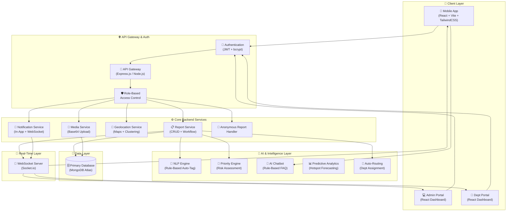

<p align="center">
  
</p>

<h1 align="center">🏙️ CivicFix — Crowdsourced Civic Issue Reporting & Resolution System</h1>

<p align="center">
  <em>Empowering citizens. Enabling governance. Engineering accountability.</em>
</p>

<p align="center">
  
  
  
  
  
  
  
</p>

---

## 📑 Table of Contents

- [Background & Motivation](#-background--motivation)
- [Problem Statement](#-problem-statement)
- [Expected Solution](#-expected-solution)
- [System Architecture](#-system-architecture)
- [Features](#-features)
- [Implementation Phases](#-implementation-phases)
- [Tech Stack](#-tech-stack)
- [Project Structure](#-project-structure)
- [Getting Started](#-getting-started)
- [Development Progress](#-development-progress)
- [Contributing](#-contributing)
- [License](#-license)

---

## 🌍 Background & Motivation

Local governments often face challenges in promptly identifying, prioritizing, and resolving everyday civic issues like **potholes**, **malfunctioning streetlights**, or **overflowing trash bins**. While citizens encounter these issues daily, a lack of effective reporting and tracking mechanisms limits municipal responsiveness.

A streamlined, **mobile-first solution** can bridge this gap by empowering community members to submit real-world reports that municipalities can systematically address.

> **CivicFix** transforms passive complaint systems into an active, AI-powered, citizen-centric platform — driving transparency, accountability, and faster resolution of civic issues.

---

## 🔴 Problem Statement

### The Challenge (La Trobe–Style)

Urban communities face persistent challenges in reporting and resolving civic issues such as **sanitation problems**, **damaged infrastructure**, and **public safety concerns**. Existing reporting mechanisms are often:

| Problem Area | Impact |
|:---|:---|
| **Fragmented channels** | Citizens don't know where or how to report |
| **Slow response** | Issues escalate before being acknowledged |
| **No real-time tracking** | Zero visibility for citizens after submission |
| **Poor prioritization** | All reports treated equally despite varying severity |
| **No data-driven insights** | Authorities cannot predict or prevent recurring issues |
| **Scalability failures** | Systems crash during peak reporting periods |

### Core Pain Points

**For Citizens:**
- No simple, real-time method to report issues with sufficient context (location + visual evidence)
- No feedback loop once a report is submitted
- Privacy concerns deter participation

**For Administrative Bodies:**
- Managing large volumes of unstructured complaints
- Prioritizing urgent cases among hundreds of submissions
- Routing reports efficiently to the appropriate departments
- Scaling during peak periods (monsoons, festivals, elections)

### The Gap

The absence of a **centralized, real-time overview** of reported issues limits data-driven decision-making, making it difficult for authorities to:
- Identify high-priority areas
- Allocate resources effectively
- Provide timely updates to citizens

> This gap highlights the need for a **scalable, user-friendly, and responsive civic issue reporting framework** that improves communication, accountability, and resolution efficiency within urban governance.

---

## ✅ Expected Solution

The final deliverable includes:

1. **Mobile-First Platform** — Cross-device citizen interface for effortless issue capture, tracking, and notifications at every stage (Confirmation → Acknowledgment → Resolution)

2. **Administrative Web Portal** — Municipal staff can filter issues by category/location/priority, assign tasks, update statuses, and communicate progress

3. **Automated Routing Engine** — Leverages report metadata (image + location + text) to correctly allocate tasks to the right departments

4. **Scalable Backend** — Manages high volumes of multimedia content, supports concurrent users, and provides APIs for future integrations

5. **Analytics & Reporting** — Insights into reporting trends, departmental response times, and overall system effectiveness

---

## 🏗️ System Architecture

### High-Level Architecture Diagram



### Data Flow — Report Lifecycle


---

## 🚀 Features

### 1. 🎛️ Multi-Role Dashboard System
| Role | Capabilities |
|:---|:---|
| **Citizens** | Submit complaints, track status via tracking ID, receive real-time updates, view community feed, upvote issues |
| **Departments** | View assigned tasks, update progress (Acknowledge → Start Work → Resolve), manage workloads |
| **Admins** | System overview with analytics, user management (role change, activate/deactivate), department assignment, staff account creation |

Role-based access control via JWT middleware ensures data isolation and streamlined operations.

---

### 2. 📰 Community Problem Feed
- **Public feed** of all reported issues with category, status, and priority filters
- **Upvote system** for authenticated users to prioritize community issues
- **2-column responsive grid** with expandable report cards
- Increases awareness, transparency, and community engagement

---

### 3. 🔄 Real-Time Tracking & Status Updates
- **Live status pipeline:** `Reported → Acknowledged → In Progress → Resolved → Closed`
- **WebSocket notifications** (Socket.io) at each stage of resolution
- **AI-estimated resolution time** displayed on tracking page
- **Unique tracking IDs** (`CF-YYMMDD-XXXXX`) with copy-to-clipboard
- Builds trust and keeps users informed in real-time

---

### 4. 🤖 AI-Powered Chatbot Assistant
- **Rule-based FAQ engine** with 15+ topic patterns covering reporting, tracking, categories, statuses, GPS, map, feed, upvotes, and more
- **Quick-reply chip buttons** for common queries
- **Navigation link buttons** that direct to relevant pages
- **Glassmorphism UI** with floating FAB button, typing indicator, and slide-up animation
- Reduces manual support dependency

---

### 5. 👻 Anonymous Reporting System
- Submit complaints **anonymously** with toggle checkbox for logged-in users
- **Auto-anonymous mode** for guest (unauthenticated) users
- Secure and confidential data handling
- Encourages more participation and honest reporting without fear

---

### 6. 🧠 AI-Powered Smart Validation of Reports
Using a **rule-based NLP engine** to:
- Detect if an issue is **already reported nearby** (Jaccard similarity-based duplicate detection)
- Flag **spam/low-quality reports** (score ≥ 0.6 blocks submission)
- **Auto-tag issue type** (up to 8 keywords) from title + description text analysis
- Reduces junk data and workload for municipal staff

---

### 7. 🎯 Priority & Risk Assessment Engine
- **Keyword-based severity scoring** from report content
- **Priority assessment** with confidence scores (0–1)
- **Auto-department routing** that overrides category mapping when AI-detected department scores 2+ more keywords
- AI analysis is **non-blocking** — failures never break report submission
- Ensures smarter resource allocation beyond "first come first serve"

---

### 8. 📈 Predictive Analytics for Governance
AI-powered forecasting built on MongoDB aggregation:
- **Hotspot clustering** — GPS grid-based area grouping (≥ 3 reports per cluster, ~500m grid cells)
- **Risk levels** — high (≥ 70%), medium (≥ 40%), low (< 40%) with confidence scores
- **Day-of-week patterns** — peak reporting day analysis
- **Category trends** — 4-week comparison with directional indicators (up/down/stable)
- **Monthly comparisons** — this month vs. last month with % change
- Helps government move from **reactive → proactive** governance

---

### 9. 🗺️ Interactive Map & Heatmap Visualization
- **Full-screen Leaflet map** with Carto Light tiles, centered on Pune, India
- **Custom SVG markers** color-coded by category (Roads 🔴, Sanitation 🟢, Water 🔵, Electricity 🟡, Parks 🟣, Traffic 🟠)
- **Density-based marker clustering** with teal→blue→indigo gradient icons
- **Canvas heatmap layer** (Blue→Cyan→Green→Yellow→Red gradient) weighted by upvotes
- **Glassmorphism filter sidebar** with category, status, and priority dropdowns
- **Interactive legend** that doubles as a quick filter
- **"Near Me" geolocation** with smooth flyTo animation
- Mobile-responsive slide-out drawer on < 768px

---

### 10. ♿ Accessibility & Inclusivity Features
- **Voice-based reporting** via Web Speech API (speech-to-text for report descriptions)
- **Skip-to-content link** visible on Tab focus
- **ARIA attributes** — `role`, `aria-label`, `aria-expanded`, `aria-haspopup`, `aria-controls` throughout navigation
- **Screen reader support** — `.sr-only` utility class
- **Focus-visible rings** on all interactive elements
- **Reduced motion** — `prefers-reduced-motion: reduce` disables all animations
- **Keyboard navigation** — Escape key closes dropdowns and modals

---

### 11. 🔔 In-App Notification System
- **6 notification types:** `status_change`, `report_assigned`, `report_upvoted`, `new_report`, `report_resolved`, `system`
- **Real-time delivery** via Socket.io WebSocket with JWT authentication
- **Persistent storage** in MongoDB with read/unread state
- **Navbar dropdown** with emoji indicators, timeAgo display, mark-read, delete, and clear actions
- **Room-based targeting** — user, role, and department rooms for scoped delivery

---

### 12. 📊 Analytics Dashboard
- **4 metric cards** with monthly comparison and trend indicators
- **Custom SVG charts** — `MiniLineChart` (daily trends), `MiniBarChart` (hourly activity), `ProgressRing` (resolution rate)
- **Horizontal bar charts** for resolution times by category and priority
- **Category/status breakdowns** with progress bars
- **Top 10 reported areas** ranked list
- **Zero charting library dependencies** — all visualizations use inline SVG

---

## 🛠️ Tech Stack

| Layer | Technology | Status |
|:---|:---|:---:|
| **Frontend** | React 19, Vite 7, TailwindCSS 4, React Router 7 | ✅ Active |
| **Backend** | Node.js, Express.js 4 | ✅ Active |
| **Database** | MongoDB Atlas (Mongoose 8) | ✅ Active |
| **Auth** | JWT (bcrypt + jsonwebtoken) | ✅ Active |
| **Real-Time** | Socket.io 4 (WebSockets) | ✅ Active |
| **Maps** | Leaflet.js + react-leaflet + leaflet.heat + react-leaflet-cluster | ✅ Active |
| **AI / NLP** | Rule-based NLP engine (`aiService.js`) — zero external ML APIs | ✅ Active |
| **Analytics** | Custom inline SVG charts + MongoDB aggregation pipelines | ✅ Active |
| **Predictions** | Rule-based hotspot clustering (~500m GPS grid) | ✅ Active |
| **Notifications** | In-app notifications (Socket.io + MongoDB) | ✅ Active |
| **Voice Input** | Web Speech API (browser-native, Chrome/Edge/Safari) | ✅ Active |
| **Chatbot** | Rule-based FAQ engine (15+ topics, `ChatBot.jsx`) | ✅ Active |
| **Accessibility** | ARIA, skip links, focus-visible, reduced motion, `.sr-only` | ✅ Active |
| **Storage** | Base64 encoding (client-side) | 🔄 Temporary |
| **Deployment** | Vercel + GitHub Actions CI/CD | ✅ Active |

---

## 📂 Project Structure

```
Latrobe-CivicFix/
├── src/
│   ├── App.jsx                          # Router with all routes + 404 + skip-to-content + ChatBot
│   ├── main.jsx                         # React entry point
│   ├── index.css                        # Design system (card, btn, input, animations, map, accessibility, chatbot)
│   ├── context/
│   │   ├── AuthContext.jsx              # Auth state management (login, register, logout, getMe)
│   │   └── NotificationContext.jsx      # Global notification state + WebSocket listeners
│   ├── services/
│   │   ├── api.js                       # API service layer (auth, users, reports, analytics, predictions, map)
│   │   └── socket.js                    # Socket.io client (JWT auth, event subscription)
│   ├── components/
│   │   ├── auth/
│   │   │   └── ProtectedRoute.jsx       # Route guard (auth + role check + loading state)
│   │   ├── layout/
│   │   │   ├── Navbar.jsx               # Top navigation (ARIA-accessible, scroll effect, user dropdown)
│   │   │   └── Footer.jsx               # Footer with quick links and SVG social icons
│   │   ├── ui/
│   │   │   ├── Button.jsx               # Reusable button (primary/secondary variants)
│   │   │   ├── NotificationBell.jsx     # Notification dropdown (emoji indicators, timeAgo)
│   │   │   └── ChatBot.jsx              # AI chatbot assistant (rule-based FAQ, 15+ topics)
│   │   └── reports/
│   │       ├── ReportCard.jsx           # Report card (3 variants: default, compact, admin)
│   │       └── FilterBar.jsx            # Filter dropdowns (category, status, priority, sort)
│   └── pages/
│       ├── Home.jsx                     # Landing page (hero, steps, features, CTA)
│       ├── Login.jsx                    # Login form (email/password, error display)
│       ├── Register.jsx                 # Register form (name, email, phone, password)
│       ├── ReportIssue.jsx              # Submit report (GPS, images, anon, AI insights, voice input)
│       ├── TrackReport.jsx              # Track by ID (status timeline + AI insights panel)
│       ├── MyReports.jsx                # Citizen's reports (filter tabs, pagination)
│       ├── PublicFeed.jsx               # Community issue feed (upvotes, filters)
│       ├── MapView.jsx                  # Interactive map + heatmap + clustering (Leaflet)
│       ├── AnalyticsDashboard.jsx       # Analytics & predictions dashboard (SVG charts)
│       ├── DepartmentDashboard.jsx      # Department task management
│       └── AdminDashboard.jsx           # Admin portal (Overview, Reports, Users, Create Staff)
│
├── server/
│   ├── index.js                         # Express app entry + Socket.io setup
│   ├── socket.js                        # Socket.io handlers (JWT auth, room management)
│   ├── package.json                     # Backend dependencies
│   ├── .env.example                     # Environment template (MONGO_URI, JWT_SECRET, etc.)
│   ├── config/
│   │   └── db.js                        # MongoDB Atlas connection (Mongoose)
│   ├── utils/
│   │   └── generateToken.js             # JWT token generator
│   ├── models/
│   │   ├── User.js                      # User schema (name, email, password, role, department)
│   │   ├── Report.js                    # Report schema (tracking ID, location, images, AI fields)
│   │   └── Notification.js              # Notification schema (6 types, read/unread)
│   ├── middleware/
│   │   └── auth.js                      # protect, optionalAuth, authorize middleware
│   ├── services/
│   │   └── aiService.js                 # AI NLP engine (tags, priority, routing, spam, duplicates, ETA)
│   ├── controllers/
│   │   ├── authController.js            # Register, login, getMe, createStaffAccount
│   │   ├── reportController.js          # Report CRUD + AI + notifications + analytics + predictions
│   │   ├── userController.js            # User management (list, update, role change, toggle status)
│   │   └── notificationController.js    # Notification CRUD (paginated, mark read, delete, clear)
│   └── routes/
│       ├── auth.js                      # POST register/login, GET me, POST create-staff
│       ├── reports.js                   # Report routes (+ /map, /analytics, /predictions)
│       ├── users.js                     # User routes (admin-gated)
│       └── notifications.js             # Notification routes (auth-required)
│
├── .env.example                         # Frontend env template (VITE_API_URL)
├── package.json                         # Frontend dependencies
├── vite.config.js                       # Vite configuration
├── index.html                           # HTML entry point
├── IMPLEMENTATION_STATUS.md             # Detailed implementation log
└── README.md                            # This file
```

---

## 🚀 Getting Started

### Prerequisites
- **Node.js** ≥ 22.x
- **npm** ≥ 9.x
- **Git**
- **MongoDB Atlas** account (free tier works)

### Installation

```bash
# Clone the repository
git clone https://github.com/Krushnakant-08/Latrobe-CivicFix.git
cd Latrobe-CivicFix

# Install frontend dependencies
npm install

# Install backend dependencies
cd server
npm install
cd ..
```

### Environment Setup

**Frontend** — Create `.env` in the project root:
```env
# Backend API base URL (must include /api suffix)
VITE_API_URL=http://localhost:5000/api
```

**Backend** — Create `server/.env`:
```env
# MongoDB Atlas connection string
MONGO_URI=mongodb+srv://<username>:<password>@<cluster>.mongodb.net/<dbname>

# JWT secret key (use a strong random string in production)
JWT_SECRET=your_jwt_secret_key_here

# Environment: development | production
NODE_ENV=development

# Server port
PORT=5000

# Frontend URL (used for CORS origin)
CLIENT_URL=http://localhost:5173
```

### Running the App

```bash
# Terminal 1 — Start the backend server
cd server
npm run dev
# Server starts at http://localhost:5000

# Terminal 2 — Start the frontend dev server
npm run dev
# App available at http://localhost:5173
```

---

## 🤝 Contributing

We welcome contributions! Please read our contributing guidelines before submitting a PR.

1. Fork the repository
2. Create your feature branch (`git checkout -b feature/amazing-feature`)
3. Commit your changes (`git commit -m 'Add amazing feature'`)
4. Push to the branch (`git push origin feature/amazing-feature`)
5. Open a Pull Request

---

## 📄 License

This project is licensed under the **MIT License** — see the [LICENSE](LICENSE) file for details.

---

<p align="center">
  <strong>Built with ❤️ for better cities</strong><br/>
  <em>CivicFix — Because every pothole deserves attention.</em>
</p>
